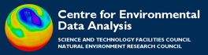
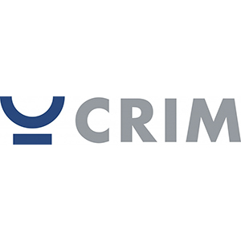

Birdhouse is an Open Source project to support web-based compute services using OGC standards
for climate data analysis.

Birdhouse is released under the
[Apache License, Version 2.0](http://birdhouse.readthedocs.io/en/latest/license.html).

Birdhouse works in close collaboration with the [{:height="50px"} GeoPython](http://geopython.github.io/) project.

## Institutional Support

The following institutions are contributing to birdhouse:

[{:height="50px"}](http://www.ceda.ac.uk/) | [{:height="50px"}](https://www.dkrz.de/?set_language=en&cl=en) | [{:height="50px"}](https://www.ipsl.fr/en)

[{:height="100px"}](https://www.crim.ca/en) | [{:height="50px"}](https://www.ouranos.ca/en/)

## Projects using Birdhouse

A list of projects using Birdhouse components:

|      |  Project | Partners |
| :--: | :--: |
| [{:height="50px"}](https://climate.copernicus.eu/) | [Climate Projections for Climate Data Service](https://cp4cds.github.io/) ([poster](https://presentations.copernicus.org/EGU2018-6491_presentation.pdf)) | [STFC/CEDA](http://www.ceda.ac.uk/), [IPSL](https://www.ipsl.fr/en), [DKRZ](https://www.dkrz.de/?set_language=en&cl=en) |
| [{:height="70px"}](https://ouranosinc.github.io/pavics-sdi/) | [PAVICS, a research platform dedicated to climate analysis and visualization](https://ouranosinc.github.io/pavics-sdi/) | [CRIM](https://www.crim.ca/en), [Ouranos](https://www.ouranos.ca/en/) |

Find further details in the [documentation](http://birdhouse.readthedocs.io/en/latest/projects.html).
